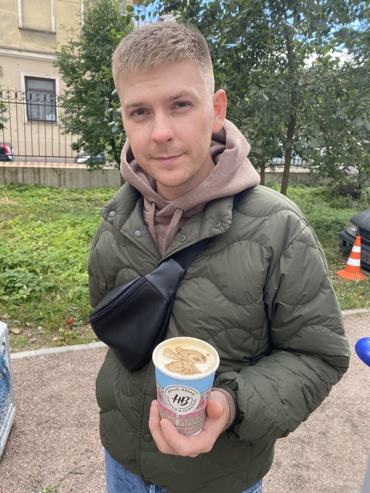

# Hello world!  

# *Меня зовут Антропов Сергей!*

 Немного о себе. Я работаю в сфере продаж с 2010г. Моя работа всегда была связана с постоянным общением с людьми, до настоящего места работы, я работал координатором отдела продаж. Последние несколько лет я работал в компании-производителе оборудования. Я занимал должность "менеджера по работе с ключевыми клиентами", я вел только крупных клиентов компании, что, я считаю, и есть самое интересное. Именно здесь есть возможность общаться с наиболее интересными людьми, твой личныq успех или командная работа играет большую роль и приносит компании хороший доход. Мне удалось добиться существенного прироста объема продаж, на основе аналитики рынке был предложен ряд мероприятий, направленных на увеличение продаж, что позволило увеличить выручку компании за 2021 год. На самом деле, мне было очень трудно уходить из компании, так как проработал там больше 3 лет, но нужно двигаться дальше. Поэтому я начал активно изучать сферу IT. И пока мне все нравится.

## До встречи на GitHub!
